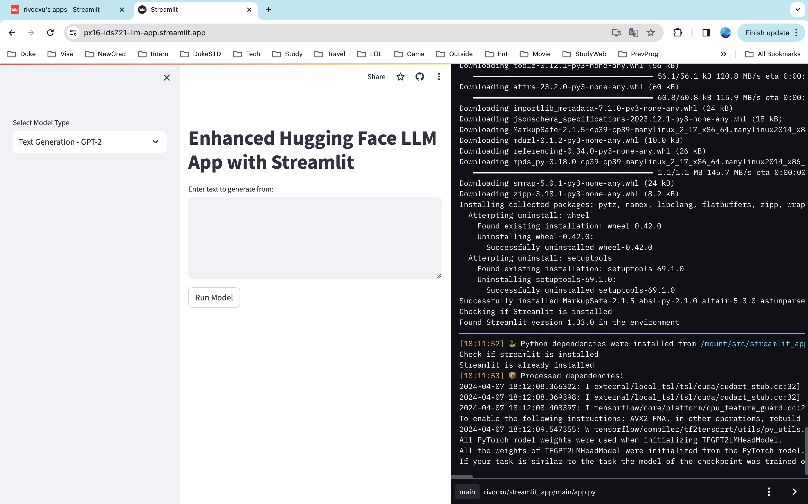
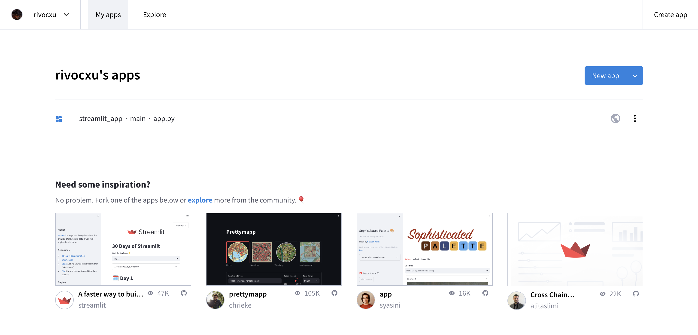
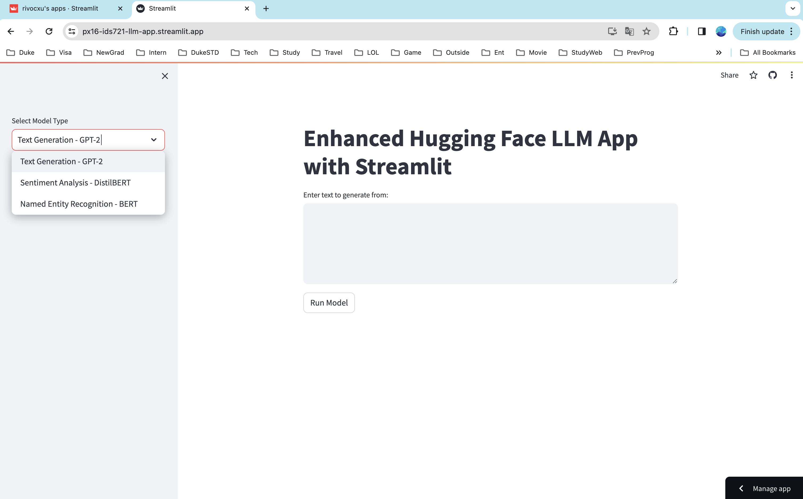
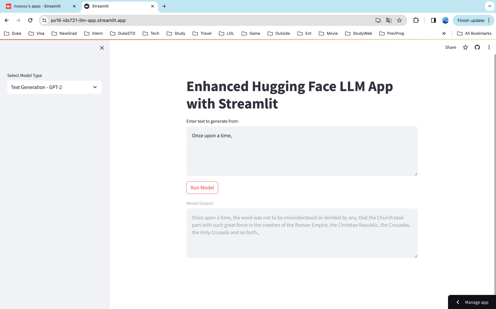
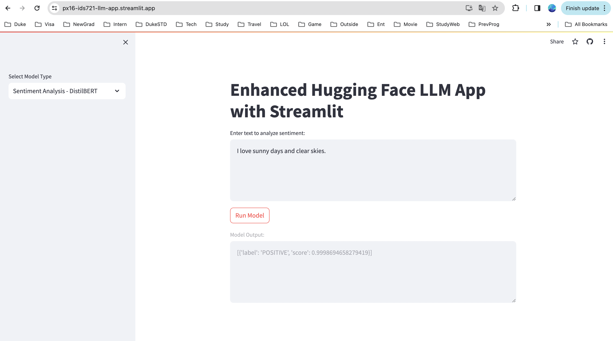
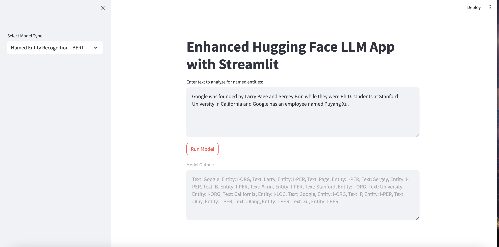

# Week 9 Mini Project
> Puyang(Rivoc) Xu (px16)

This project is a Streamlit App with a Hugging Face Model. The main function of this app is using three different types of models: GPT-2, DistilBERT and BERT.

URL: https://px16-ids721-llm-app.streamlit.app/

## Preparation
The installation of `Python`, `pip`, `streamlit` and following libraries is needed in this project.
```
pip3 install streamlit transformers
pip3 install torch torchvision torchaudio
pip3 install tensorflow
pip3 install tf-keras
```
You can test the installation by `test.py`.

Create a `requirement.txt` with following content:
```
streamlit 
transformers
tensorflow
tf-keras
```

## Functionalities
Create a file called `app.py`. Write some functionalities. Detailed information as following.

This project integrates multiple Hugging Face models into a single Streamlit web application, offering users the ability to interact with various natural language processing (NLP) capabilities. The app provides a user-friendly interface for experimenting with text-based AI models, including text generation, sentiment analysis, and named entity recognition.

### Features

- **Model Selection**: Users can choose from three different types of NLP models:
  - **Text Generation (GPT-2)**: Generates text based on a given prompt.
  - **Sentiment Analysis (DistilBERT)**: Analyzes the sentiment of the input text as positive, negative, or neutral.
  - **Named Entity Recognition (BERT)**: Identifies and labels entities within the text, such as person names, organizations, locations, and dates.

- **User Interaction**: The app provides a simple and interactive way for users to input text and receive model outputs.
  - A sidebar for selecting the model type.
  - A text area for users to input their text.
  - A button to process the input through the selected model.
  - A display area for the model output, formatted according to the type of analysis performed.

### Usage

1. **Select a Model**: Use the sidebar to choose between text generation, sentiment analysis, or named entity recognition.
2. **Enter Text**: Input the text you want the model to process in the provided text area.
3. **Generate/Analyze**: Click the "Run Model" button to see the model's output based on your input.

## Test & Deploy
Test locally:
```
streamlit run app.py
```
Then the website can be accessed by: http://localhost:8501/

To deploy the app, sign in https://streamlit.io/

Then create an app using existing repo.

Deploy the app.


Then you can see it in your apps.


And you can access the app using following url:
https://px16-ids721-llm-app.streamlit.app/


## Results & Screenshots

### Application root page


### Text Generation (GPT-2)


### Sentiment Analysis (DistilBERT)


### Named Entity Recognition (BERT)
